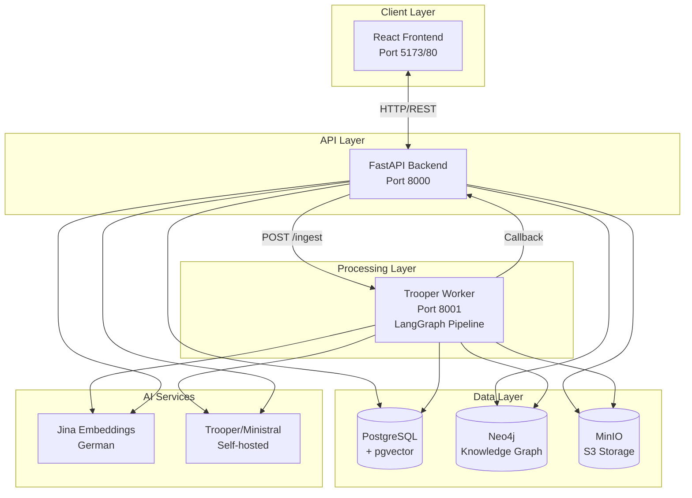
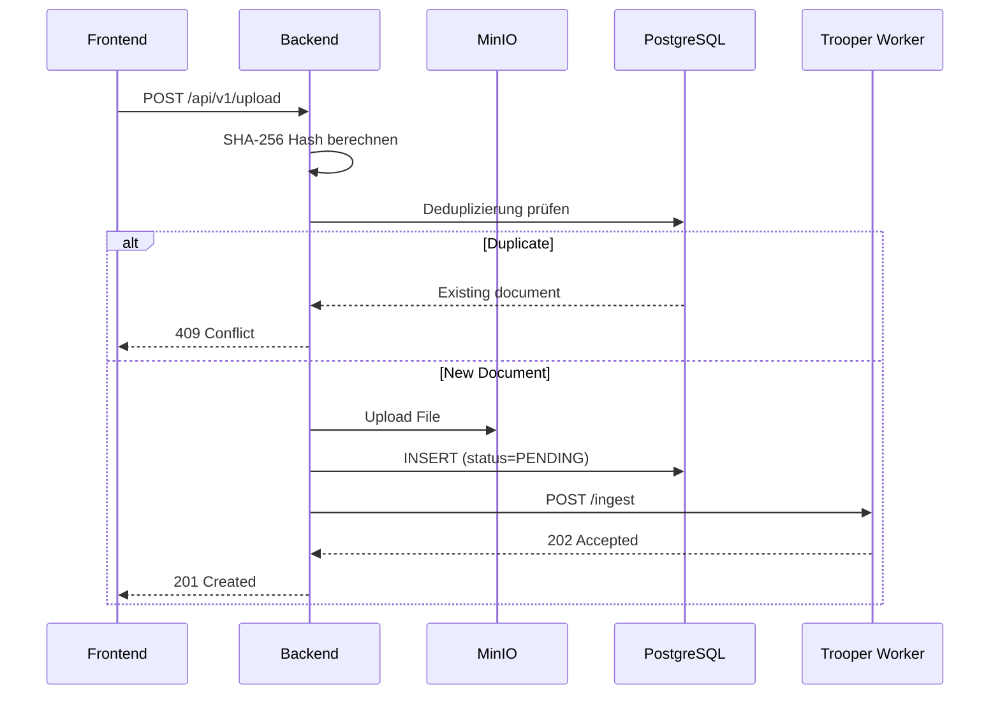
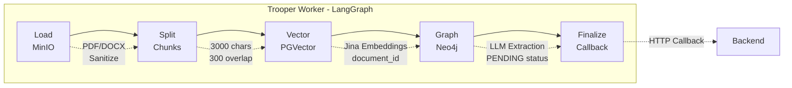
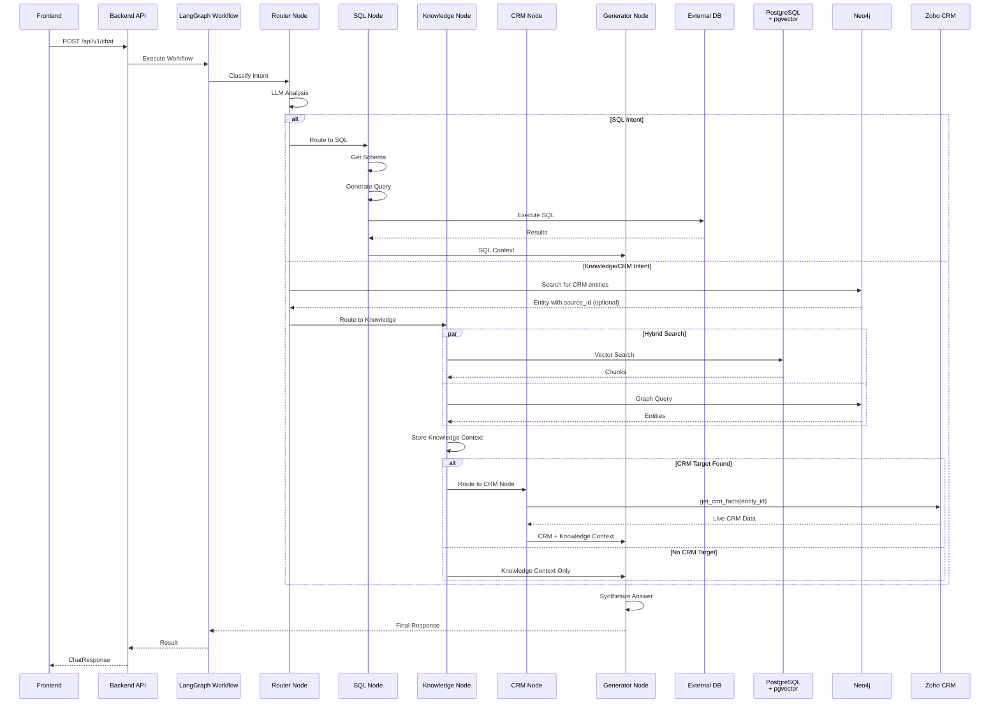
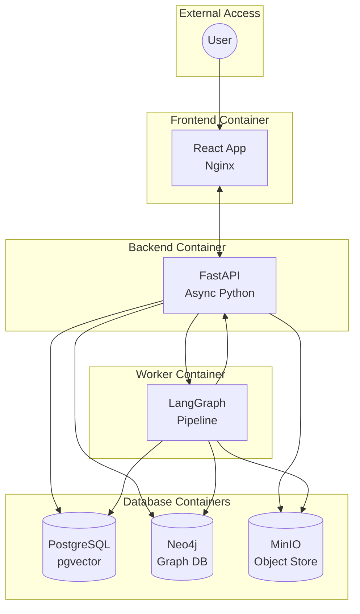
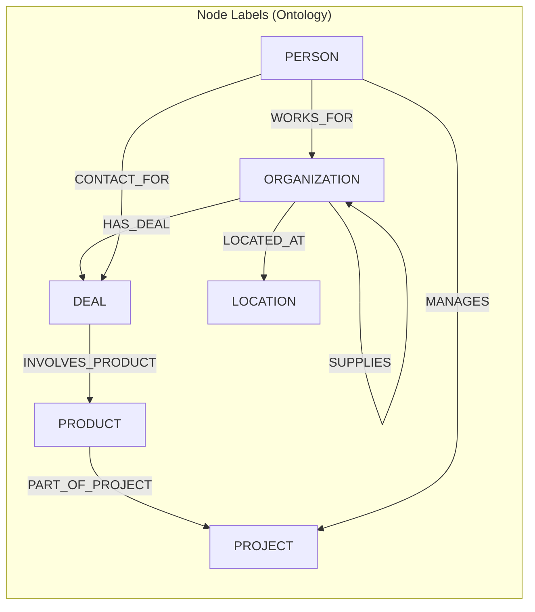
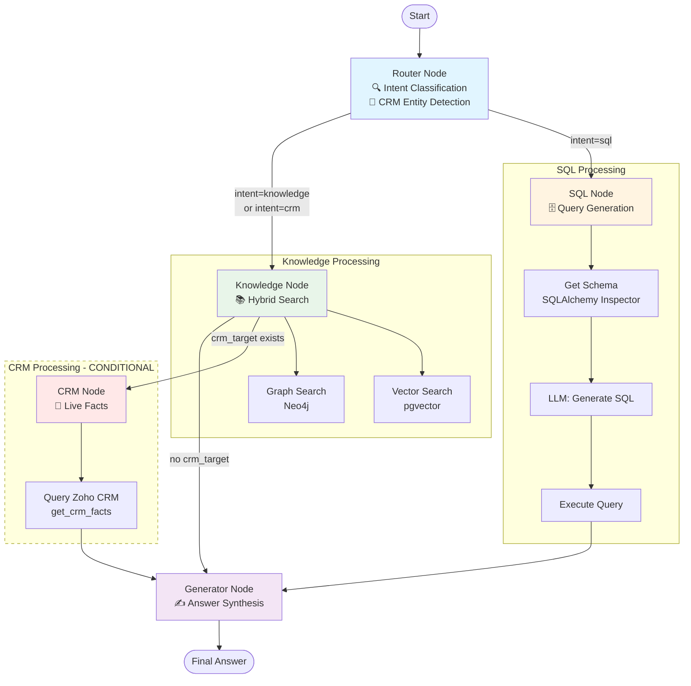
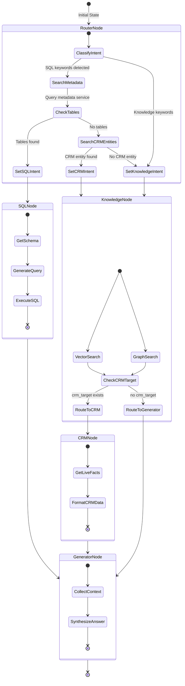
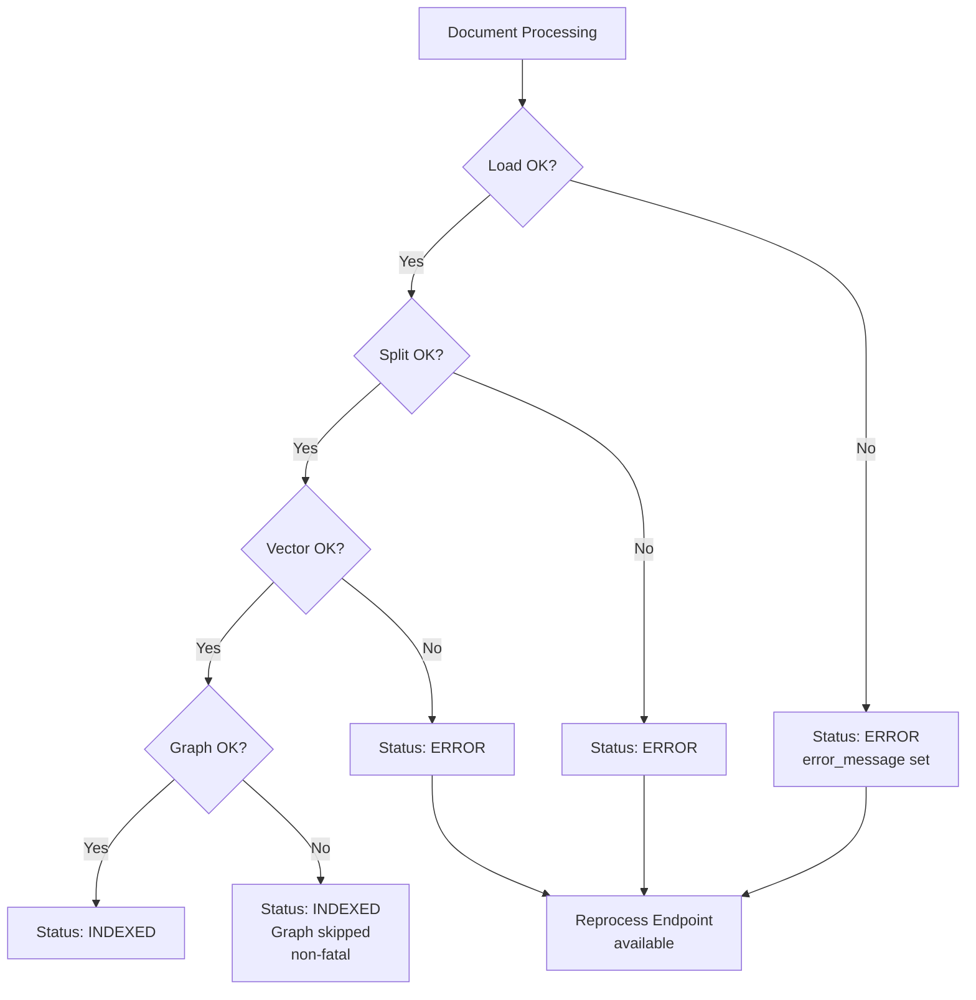

# Adizon Knowledge Core - Architecture Documentation

## Overview

**Adizon Knowledge Core** (auch bekannt als **Adizon Enterprise-Intelligence-System**) ist ein fortschrittliches, agentisches RAG-System (Retrieval-Augmented Generation) mit integrierter Knowledge Graph Funktionalität und SQL-Integrationsfähigkeiten. Es kombiniert drei Hauptdatenquellen:

1. **Semantische Vektorsuche** (pgvector) für Dokumenten-Chunks
2. **Knowledge Graph** (Neo4j) für Entity-Beziehungen
3. **Externe SQL-Datenbanken** für strukturierte Geschäftsdaten

Das System nutzt **LangGraph** für intelligentes, autonomes Routing und Multi-Source Intelligence.

## System Architecture



## Tech Stack

| Komponente | Technologie |
|------------|-------------|
| Backend | FastAPI + async Python 3.11 |
| Frontend | React 19 + TypeScript + Tailwind CSS |
| Vector Store | PostgreSQL + pgvector |
| Knowledge Graph | Neo4j 5.x |
| File Storage | MinIO (S3-kompatibel) |
| Embeddings | Jina German / OpenAI-kompatible APIs |
| LLM | Trooper/Ministral (self-hosted) |
| Workflow | LangGraph |

## Projektstruktur

```
adizon-knowledge-core/
├── backend/                    # FastAPI Backend (Port 8000)
│   ├── app/
│   │   ├── main.py            # Entry Point
│   │   ├── api/endpoints/     # REST Endpoints
│   │   │   ├── chat.py        # ⭐ Agentic RAG Integration
│   │   │   ├── ingestion.py
│   │   │   └── graph.py
│   │   ├── core/
│   │   │   ├── config.py      # Konfiguration
│   │   │   └── llm.py         # ⭐ LLM Factory
│   │   ├── db/                # Database Session
│   │   ├── models/            # SQLAlchemy Models
│   │   ├── services/          # Business Logic
│   │   │   ├── metadata_store.py    # ⭐ External Sources
│   │   │   ├── sql_connector.py     # ⭐ SQL Connections
│   │   │   ├── vector_store.py
│   │   │   ├── graph_store.py
│   │   │   └── storage.py
│   │   ├── graph/             # LangGraph Workflows
│   │   │   ├── chat_workflow.py     # ⭐ Agentic RAG
│   │   │   └── ingestion_workflow.py
│   │   ├── tools/             # ⭐ Agent Tools
│   │   │   ├── knowledge.py   # Knowledge Search
│   │   │   └── sql.py         # SQL Execution
│   │   └── config/            # Configuration Files
│   │       ├── ontology_voltage.yaml
│   │       └── external_sources.yaml  # ⭐ SQL Sources
│   └── Dockerfile
├── frontend/                   # React Frontend (Port 5173/80)
│   ├── src/
│   │   ├── pages/             # Chat, Garden, Upload
│   │   ├── components/        # Reusable UI
│   │   └── api/client.ts      # API Client
│   └── Dockerfile
├── trooper_worker/             # Compute Worker (Port 8001)
│   ├── main.py                # Worker Entry
│   ├── workflow.py            # LangGraph Pipeline
│   ├── core/config.py         # Worker Config
│   ├── services/              # Processing Services
│   └── config/                # Ontology Files
├── deployment/                 # Deployment Configs
│   └── trooper/               # Trooper-spezifisch
├── docs/                       # Dokumentation
└── docker-compose.yml          # Local Stack
```

## Datenfluss

### Document Upload Flow



### Document Processing Pipeline



### Chat Query Flow (Agentic RAG v2.0)



## Microservices Architecture



## Datenbank Schemas

### PostgreSQL (knowledge_documents)

| Column | Type | Description |
|--------|------|-------------|
| id | UUID | Primary Key |
| filename | VARCHAR(512) | Original Filename |
| content_hash | VARCHAR(64) | SHA-256 (Unique, Dedupe) |
| file_size | BIGINT | Dateigröße |
| storage_path | TEXT | MinIO Pfad |
| status | ENUM | PENDING / INDEXED / ERROR |
| error_message | TEXT | Fehlermeldung |
| created_at | TIMESTAMP | Erstellungsdatum |

### Neo4j Schema



**Node Properties:**
- `name` (Merge Key)
- `status` (PENDING / APPROVED)
- `source_document_id`, `source_file`
- `created_at`, `updated_at`, `approved_at`

## API Endpoints

### Ingestion

| Method | Endpoint | Beschreibung |
|--------|----------|--------------|
| POST | `/api/v1/upload` | Dokument hochladen |
| GET | `/api/v1/documents` | Alle Dokumente auflisten |
| GET | `/api/v1/documents/{id}` | Einzelnes Dokument |
| POST | `/api/v1/documents/{id}/reprocess` | Erneut verarbeiten |
| POST | `/api/v1/documents/{id}/status` | Status-Update (Worker) |
| DELETE | `/api/v1/documents/{id}` | Löschen (kaskadierend) |

### Chat

| Method | Endpoint | Beschreibung |
|--------|----------|--------------|
| POST | `/api/v1/chat` | Hybrid RAG Chat |
| POST | `/api/v1/chat/stream` | Streaming Chat (SSE) |
| GET | `/api/v1/knowledge/summary` | Wissensbasis Übersicht |

### Graph

| Method | Endpoint | Beschreibung |
|--------|----------|--------------|
| GET | `/api/v1/graph/pending` | Ausstehende Nodes |
| POST | `/api/v1/graph/approve` | Nodes genehmigen |
| POST | `/api/v1/graph/reject` | Nodes ablehnen |
| POST | `/api/v1/graph/query` | Cypher Query ausführen |

## Agentic RAG Architecture (v2.0)

### LangGraph Workflow



### Agent State Flow



### Agent Tools

| Tool | Purpose | Location |
|------|---------|----------|
| `search_knowledge_base` | Hybrid RAG (Vector+Graph) | `app/tools/knowledge.py` |
| `execute_sql_query` | Run SELECT queries | `app/tools/sql.py` |
| `get_sql_schema` | Inspect table schemas | `app/tools/sql.py` |
| `get_crm_facts` | Fetch live CRM data | `app/tools/crm.py` |
| `check_crm_status` | Check CRM availability | `app/tools/crm.py` |

### External Source Configuration

```yaml
# backend/app/config/external_sources.yaml
sources:
  - id: "erp_postgres"
    type: "sql"
    description: "Business data: revenue, customers, invoices"
    connection_env: "ERP_DATABASE_URL"
    tables:
      - name: "invoices"
        description: "Invoice records with amounts and dates"
```

**Services:**
- **MetadataService**: Discovers relevant tables based on query
- **SQLConnectorService**: Manages database connections with pooling

## Multi-Tenant Ontology

Die Ontology wird via YAML konfiguriert (`ontology_voltage.yaml`):

```yaml
domain_name: "Voltage Solutions"
description: "B2B Photovoltaics provider"

node_types:
  - name: "ORGANIZATION"
    description: "Companies, Suppliers, Clients"
  # ...

relationship_types:
  - name: "WORKS_FOR"
    description: "Employment relationship"
  # ...
```

**SchemaFactory** generiert dynamisch Pydantic Models mit Literal-Constraints für typsichere LLM-Extraktion.

## Umgebungsvariablen

```bash
# PostgreSQL
POSTGRES_HOST, POSTGRES_PORT, POSTGRES_DB, POSTGRES_USER, POSTGRES_PASSWORD

# Neo4j
NEO4J_URI, NEO4J_USER, NEO4J_PASSWORD

# MinIO
MINIO_ENDPOINT, MINIO_ACCESS_KEY, MINIO_SECRET_KEY, MINIO_BUCKET_NAME

# AI/LLM (Required)
EMBEDDING_API_URL, EMBEDDING_API_KEY, EMBEDDING_MODEL, LLM_MODEL_NAME

# Trooper Worker
TROOPER_URL, TROOPER_AUTH_TOKEN

# Ontology
ONTOLOGY_PATH
```

## Error Handling



1. **Document Processing Fehler:**
   - Status wird auf ERROR gesetzt
   - error_message enthält Details
   - Reprocess-Endpoint ermöglicht erneuten Versuch

2. **Graph Extraction Fehler:**
   - Non-fatal: Dokument wird trotzdem als INDEXED markiert
   - Nur Vektor-Fehler führen zu ERROR Status

3. **Worker Connectivity:**
   - 30s Timeout für Trooper-Requests
   - TrooperDispatchError bei Verbindungsproblemen
