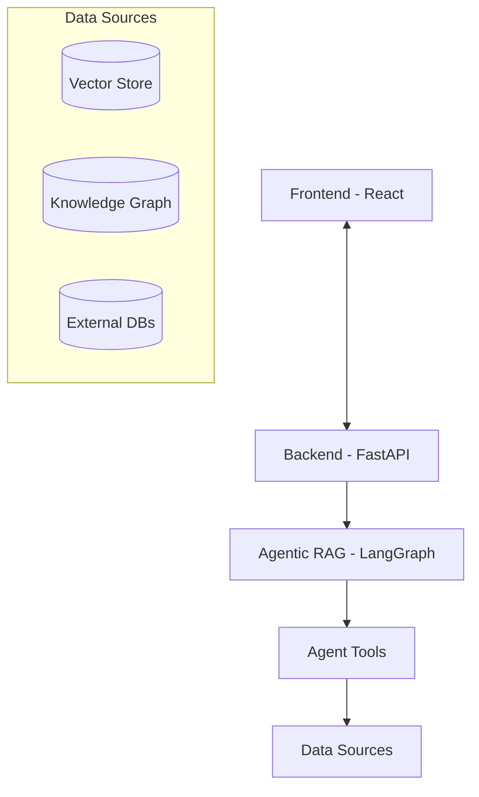

# Adizon Enterprise-Intelligence-System - Dokumentation

**Version 2.0** - Agentic RAG Architecture 🚀

## 🎯 Start Here

| Dein Ziel | Empfohlene Dokumentation |
|-----------|-------------------------|
| **Schnellstart** | 👉 [QUICK_START.md](QUICK_START.md) - In 10 Minuten starten |
| **Agentic RAG verstehen** | 👉 [AGENTIC_RAG.md](AGENTIC_RAG.md) - Vollständiger Guide |
| **System-Architektur** | 👉 [ARCHITECTURE.md](ARCHITECTURE.md) - Technische Details |
| **API nutzen** | 👉 [API.md](API.md) - REST API Reference |
| **Deployment** | 👉 [DEPLOYMENT.md](DEPLOYMENT.md) - Local, Docker, Railway |

---

## 📚 Hauptdokumentation

### Neu in Version 2.0+

| Dokument | Beschreibung |
|----------|--------------|
| **[GRAPH_SCHEMA.md](GRAPH_SCHEMA.md)** | ✨ **NEU V2.1:** Complete Neo4j Graph Schema Documentation |
| **[AGENTIC_RAG.md](AGENTIC_RAG.md)** | ✨ **NEU:** Kompletter Guide zur Agentic RAG Architektur |
| **[QUICK_START.md](QUICK_START.md)** | ✨ **NEU:** 10-Minuten Quick Start Guide |

### Kern-Dokumentation

| Dokument | Beschreibung |
|----------|--------------|
| **[ARCHITECTURE.md](ARCHITECTURE.md)** | 🔄 **Aktualisiert:** Systemarchitektur, Tech Stack, Datenfluss, Agentic RAG |
| **[API.md](API.md)** | REST API Reference und Beispiele |
| **[DEPLOYMENT.md](DEPLOYMENT.md)** | Deployment Guide (Local, Docker, Railway) |
| **[ONTOLOGY.md](ONTOLOGY.md)** | Ontology-Konfiguration für Multi-Tenant |

### Änderungsprotokolle

| Dokument | Beschreibung |
|----------|--------------|
| **[2026-01-10: Graph Schema V2](changelogs/2026-01-10_graph-schema-v2.md)** | ✨ **NEU:** Typed Graph Schema, 12+ Node Types, Batch Processing |
| **[2026-01-08: CRM Integration](changelogs/2026-01-08_crm-integration.md)** | ✨ **NEU:** Modular CRM Plugin System (Zoho) |
| **[2026-01-08: Agentic RAG v2.0](changelogs/2026-01-08_agentic-rag-v2.md)** | ✨ **NEU:** Version 2.0 Release Notes |
| [2025-01-04: Hybrid Architecture](changelogs/2025-01-04_hybrid-architecture.md) | Multi-Tenant Ontology, Trooper Worker |

---

## 🎓 Lernpfade

### Für Entwickler

1. **Basics verstehen**
   - 📖 Start: [QUICK_START.md](QUICK_START.md)
   - 📖 Dann: [ARCHITECTURE.md](ARCHITECTURE.md) - System Overview

2. **Agentic RAG im Detail**
   - 📖 [AGENTIC_RAG.md](AGENTIC_RAG.md) - Kompletter Guide
   - 💻 Code: `backend/app/graph/chat_workflow.py`
   - 🔧 Tools: `backend/app/tools/`

3. **API Integration**
   - 📖 [API.md](API.md)
   - 🌐 Interactive Docs: http://localhost:8000/docs

### Für Administratoren

1. **Setup & Deployment**
   - 📖 [QUICK_START.md](QUICK_START.md)
   - 📖 [DEPLOYMENT.md](DEPLOYMENT.md)

2. **Konfiguration**
   - 📄 `backend/.env` - Environment Variables
   - 📄 `backend/app/config/external_sources.yaml` - SQL Sources
   - 📄 `backend/app/config/ontology_voltage.yaml` - Knowledge Graph

3. **Troubleshooting**
   - 📖 [AGENTIC_RAG.md - Troubleshooting](AGENTIC_RAG.md#troubleshooting)
   - 📖 [DEPLOYMENT.md - Troubleshooting](DEPLOYMENT.md#troubleshooting)

---

## 🆕 Was ist neu in Version 2.0?

### Agentic RAG Architecture

**Vorher (v1.0):** Simple Hybrid RAG
```
Query → Vector Search → Graph Search → LLM → Answer
```

**Jetzt (v2.0):** Intelligentes Agentic System
```
Query → Router (LLM) → [SQL | Knowledge] → Generator → Answer
                          ↓          ↓
                     External DB  Vector+Graph
```

### Hauptfeatures

- 🤖 **LangGraph-basierter Agent** mit autonomem Routing
- 🗄️ **SQL Query Generation** aus natürlicher Sprache
- 🔍 **Multi-Source Intelligence** (Dokumente + Graphs + Datenbanken)
- 🌊 **Smart Streaming** ohne interne Leaks
- 📊 **Schema Discovery** für externe Datenquellen
- 🛡️ **Enterprise Security** mit Query-Validierung

**Mehr Details:** [Version 2.0 Changelog](changelogs/2026-01-08_agentic-rag-v2.md)

---

## 🏗️ Projekt-Struktur

```
adizon-knowledge-core/
├── backend/                    # FastAPI Backend
│   └── app/
│       ├── api/endpoints/      # REST Endpoints
│       ├── graph/             # ✨ LangGraph Workflows
│       │   └── chat_workflow.py    # Agentic RAG Workflow
│       ├── tools/             # ✨ Agent Tools (NEW)
│       │   ├── knowledge.py
│       │   └── sql.py
│       ├── services/          # Business Logic
│       │   ├── metadata_store.py   # ✨ External Sources (NEW)
│       │   └── sql_connector.py    # ✨ SQL Connections (NEW)
│       ├── core/
│       │   └── llm.py         # ✨ LLM Factory (NEW)
│       └── config/            # Configuration
│           ├── ontology_voltage.yaml
│           └── external_sources.yaml  # ✨ SQL Config (NEW)
├── frontend/                  # React Frontend
├── deployment/                # Deployment Configs
├── docs/                      # Dokumentation (hier!)
└── docker-compose.yml         # Local Stack
```

---

## 🔗 Quick Links

### Development

- [Lokale Entwicklung starten](QUICK_START.md#step-4-start-backend)
- [API Endpoints](API.md)
- [Architektur-Übersicht](ARCHITECTURE.md#overview)
- [Agent Workflow](AGENTIC_RAG.md#workflow-execution-flow)

### Configuration

- [Environment Variables](QUICK_START.md#step-2-configure-environment)
- [External Sources Setup](AGENTIC_RAG.md#external-source-configuration)
- [Ontologie konfigurieren](ONTOLOGY.md#neue-ontologie-erstellen)

### Deployment

- [Docker Deployment](DEPLOYMENT.md#docker-deployment)
- [Railway Deployment](DEPLOYMENT.md#railway-deployment)
- [Worker deployen](DEPLOYMENT.md#trooper-worker-deployment)

---

## 📊 System-Übersicht

### Architektur-Schichten



**Mehr Details:** [ARCHITECTURE.md](ARCHITECTURE.md)

---

## 🎯 Feature-Matrix

| Feature | v1.0 | v2.0 |
|---------|------|------|
| Vector Search | ✅ | ✅ |
| Knowledge Graph | ✅ | ✅ |
| Document Upload | ✅ | ✅ |
| Entity Extraction | ✅ | ✅ |
| **Agentic Routing** | ❌ | ✅ |
| **SQL Integration** | ❌ | ✅ |
| **LangGraph Workflow** | ❌ | ✅ |
| **Multi-Source Intelligence** | ❌ | ✅ |
| **Smart Streaming** | ❌ | ✅ |

---

## 🆘 Support & Troubleshooting

### Häufige Probleme

| Problem | Lösung |
|---------|--------|
| Backend startet nicht | [Quick Start - Troubleshooting](QUICK_START.md#troubleshooting) |
| SQL Queries funktionieren nicht | [Agentic RAG - SQL Troubleshooting](AGENTIC_RAG.md#issue-sql-query-fails) |
| LLM Errors | [Quick Start - LLM Errors](QUICK_START.md#llm-errors) |
| Keine Tabellen gefunden | [Agentic RAG - No Tables Found](AGENTIC_RAG.md#issue-no-relevant-tables-found) |

### Weitere Hilfe

- 📖 [Vollständiges Troubleshooting](AGENTIC_RAG.md#troubleshooting)
- 🐛 [GitHub Issues](https://github.com/expoya/adizon-knowledge-core/issues)
- 📧 Support: support@adizon.de

---

## 📈 Roadmap

### Phase 4: True Hybrid Mode (Q1 2026)
- [ ] Parallele Ausführung von SQL + Knowledge
- [ ] Cross-Source Joins
- [ ] Unified Context Ranking

### Phase 5: Advanced Features (Q2 2026)
- [ ] Query Result Caching
- [ ] Multi-Step SQL Reasoning
- [ ] Schema Evolution Tracking
- [ ] User Feedback Loop

### Phase 6: Enterprise (Q3 2026)
- [ ] RBAC (Role-Based Access Control)
- [ ] Audit Logging
- [ ] Cost Estimation
- [ ] Multi-Tenant Isolation

---

## 📄 License

Proprietary - Adizon GmbH

---

## 👥 Team

**Entwicklung:** Adizon Development Team  
**Dokumentation:** AI-Assisted  
**Maintainer:** Michael Schiestl

---

**Version:** 2.0.0  
**Last Updated:** January 8, 2026  
**Status:** ✅ Production Ready
