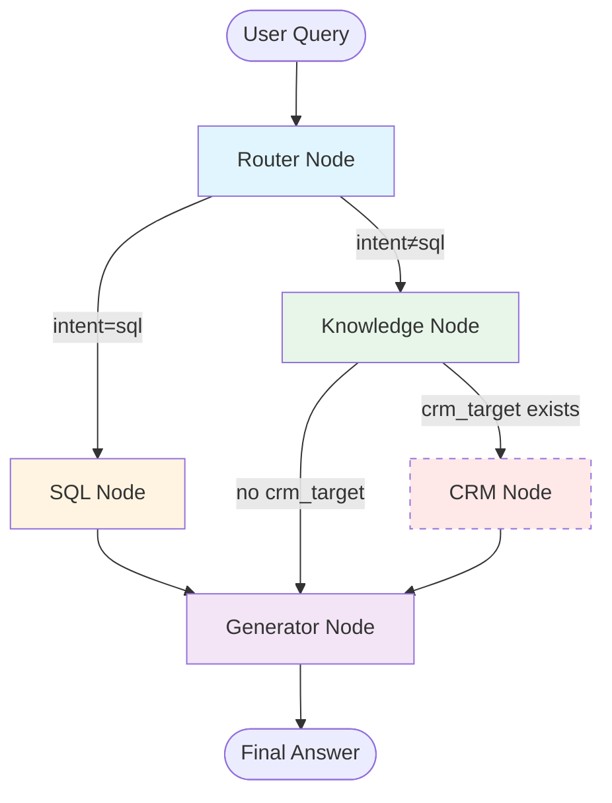

# 🔀 LangGraph Routing-Logik

> **Erstellt:** 2026-01-10  
> **Aktualisiert:** 2026-01-10 (Phase 1 Refactoring abgeschlossen)  
> **Status:** Phase 1 - SQL Node entfernt, Simplified Routing

⚠️ **WICHTIG:** Dieses Dokument beschreibt die ALTE Architektur.  
Siehe `REFACTORING_SMART_ORCHESTRATOR.md` für die neue Architektur.

---

## ✅ Phase 1 Änderungen (Abgeschlossen)

**Was wurde entfernt:**
- ❌ SQL Node (Dead Code)
- ❌ sql_context aus AgentState
- ❌ should_use_sql() Routing-Funktion
- ❌ Intent "sql" aus Intent Classification

**Was ist jetzt:**
- ✅ Nur 2 Intents: "question" und "general"
- ✅ Router → Knowledge Orchestrator → [optional: CRM] → Generator
- ✅ 4 Nodes statt 5: router, knowledge, crm, generator

---

Dieses Dokument beschreibt die Routing-Logik des LangGraph Chat Workflows in `backend/app/graph/chat_workflow.py`.

---

## 📊 Workflow-Übersicht



---

## 🎯 Intent-Klassifizierung

### Router Node Logik

Der Router Node führt folgende Schritte aus:

1. **LLM Intent Classification** (temperature=0.0)
   - Analysiert User-Query
   - Bestimmt primären Intent

2. **Metadata Service Check**
   - Prüft ob relevante Tabellen vorhanden sind
   - Setzt `sql_context` wenn gefunden

3. **CRM Entity Detection**
   - Sucht im Knowledge Graph nach Entities mit `source_id` (z.B. "zoho_123456")
   - Prüft ob Entity-Name in Query erwähnt wird
   - Setzt `crm_target` wenn gefunden

### Intent Types

| Intent | Beschreibung | Beispiel-Query |
|--------|--------------|----------------|
| `sql` | Finanzielle/strukturierte Daten aus externer DB | "Welche Rechnungen im Dezember?" |
| `knowledge` | Dokument-basierte Suche (Vector + Graph) | "Was ist unsere Preispolitik?" |
| `crm` | Knowledge + Live CRM-Facts | "Was ist der Status von Firma X?" |
| `general` | Allgemeine Fragen ohne spezifischen Kontext | "Wie geht es dir?" |

---

## 🚦 Routing-Regeln

### 1. Router → SQL/Knowledge

```python
def should_use_sql(state: AgentState) -> str:
    intent = state.get("intent", "")
    return "sql" if intent in ["sql", "hybrid"] else "skip_sql"
```

**Routing:**
- `intent="sql"` → SQL Node
- Alles andere → Knowledge Node

### 2. Knowledge → CRM/Generator

```python
def should_use_crm(state: AgentState) -> str:
    intent = state.get("intent", "")
    has_target = bool(state.get("crm_target"))
    return "crm" if intent == "crm" and has_target else "skip_crm"
```

**Routing:**
- `intent="crm"` UND `crm_target` vorhanden → CRM Node
- Sonst → Generator Node

---

## 🔧 Node-Beschreibungen

### Router Node
**Datei:** `backend/app/graph/chat_workflow.py`

**Aufgaben:**
- Intent Classification via LLM
- Metadata Service Query für SQL-Tabellen
- Graph Query für CRM-Entities
- State-Updates: `intent`, `sql_context`, `crm_target`

**Output:**
```python
state = {
    "intent": "crm",
    "crm_target": "zoho_3652397000000649013",
    ...
}
```

### SQL Node
**Datei:** `backend/app/graph/chat_workflow.py`

**Aufgaben:**
- Schema-Abfrage via `get_sql_schema` tool
- SQL-Generierung via LLM
- Query-Ausführung via `execute_sql_query` tool
- Speichert Ergebnis in `tool_outputs["sql_result"]`

**Tools:**
- `get_sql_schema(source_id, table_names)`
- `execute_sql_query(query, source_id)`

**Next Node:** Generator Node

### Knowledge Node
**Datei:** `backend/app/graph/chat_workflow.py`

**Aufgaben:**
- Hybrid Search via `search_knowledge_base` tool
  - Vector Search (pgvector): Top 5 chunks mit score ≥ 0.8
  - Graph Search (Neo4j): Entities und Relationships
- Speichert Ergebnis in `tool_outputs["knowledge_result"]`
- Prüft ob CRM-Daten benötigt werden

**Tools:**
- `search_knowledge_base(query)`

**Next Node:** 
- CRM Node (wenn `crm_target` gesetzt)
- Generator Node (sonst)

### CRM Node (CONDITIONAL)
**Datei:** `backend/app/graph/chat_workflow.py`

**Aufgaben:**
- Live CRM-Abfrage via `get_crm_facts` tool
- Holt aktuelle Daten aus Zoho CRM
- Speichert Ergebnis in `tool_outputs["crm_result"]`

**Tools:**
- `get_crm_facts(entity_id, query_context)`

**Aktivierung:** Nur wenn `crm_target` im State vorhanden

**Next Node:** Generator Node

### Generator Node
**Datei:** `backend/app/graph/chat_workflow.py`

**Aufgaben:**
- Sammelt alle `tool_outputs`
- Synthesiert finale Antwort via LLM (temperature=0.7)
- Kombiniert Kontexte aus allen vorherigen Nodes

**Input:**
```python
tool_outputs = {
    "sql_result": "...",        # Optional
    "knowledge_result": "...",  # Optional
    "crm_result": "..."        # Optional
}
```

**Output:** Finale User-Antwort als `AIMessage`

**Next Node:** END

---

## 📝 State-Definition

```python
class AgentState(TypedDict):
    messages: List[AnyMessage]          # Conversation history
    intent: str                         # "sql" | "knowledge" | "crm" | "general"
    sql_context: Dict[str, Any]         # {"source_id": "...", "table_names": [...]}
    crm_target: str                     # Entity ID (z.B. "zoho_123456")
    tool_outputs: Dict[str, str]        # Tool results storage
```

---

## 🔄 Workflow-Konstruktion

```python
def create_chat_workflow() -> StateGraph:
    workflow = StateGraph(AgentState)
    
    # Nodes
    workflow.add_node("router", router_node)
    workflow.add_node("sql", sql_node)
    workflow.add_node("knowledge", knowledge_node)
    workflow.add_node("crm", crm_node)
    workflow.add_node("generator", generation_node)
    
    # Entry Point
    workflow.set_entry_point("router")
    
    # Edges
    workflow.add_conditional_edges("router", should_use_sql, {
        "sql": "sql",
        "skip_sql": "knowledge"
    })
    
    workflow.add_edge("sql", "generator")
    
    workflow.add_conditional_edges("knowledge", should_use_crm, {
        "crm": "crm",
        "skip_crm": "generator"
    })
    
    workflow.add_edge("crm", "generator")
    workflow.add_edge("generator", END)
    
    return workflow.compile()
```

---

## 🧪 Beispiel-Flows

### Flow 1: SQL Query
```
User: "Welche Rechnungen haben wir im Dezember?"

Router: 
  - LLM Classification → "sql" 
  - Metadata Service → gefunden: "invoices"
  - Intent = "sql", sql_context = {...}

SQL Node:
  - get_sql_schema("erp_postgres", ["invoices"])
  - LLM generates SQL
  - execute_sql_query(...)
  - tool_outputs["sql_result"] = [...]

Generator:
  - Synthesiert Antwort mit SQL-Resultaten

Output: "Im Dezember gab es 15 Rechnungen mit einem Gesamtwert von €45,000."
```

### Flow 2: Knowledge + CRM
```
User: "Was ist der Status von Voltage Solutions?"

Router:
  - LLM Classification → "knowledge"
  - Metadata Service → keine Tabellen gefunden
  - Graph Search → gefunden: "zoho_3652397000000649013" (Voltage Solutions)
  - Intent = "crm", crm_target = "zoho_3652397000000649013"

Knowledge Node:
  - search_knowledge_base("Voltage Solutions")
  - Vector + Graph Search
  - tool_outputs["knowledge_result"] = [...]
  - Check: crm_target vorhanden → route zu CRM

CRM Node:
  - get_crm_facts("zoho_3652397000000649013", "Status")
  - Zoho API Call
  - tool_outputs["crm_result"] = [...]

Generator:
  - Kombiniert Knowledge + CRM Facts
  - Synthesiert Antwort

Output: "Voltage Solutions ist ein aktiver Kunde mit 2 offenen Deals (Solar Installation: €50k, Consulting: €5k). Letzte Aktivität: 05.01.2026."
```

### Flow 3: Pure Knowledge
```
User: "Was ist unsere Preispolitik?"

Router:
  - LLM Classification → "knowledge"
  - Metadata Service → keine Tabellen
  - Graph Search → keine CRM-Entity erwähnt
  - Intent = "knowledge"

Knowledge Node:
  - search_knowledge_base("Preispolitik")
  - Vector + Graph Search
  - tool_outputs["knowledge_result"] = [...]
  - Check: kein crm_target → route zu Generator

Generator:
  - Synthesiert Antwort mit Knowledge-Kontext

Output: "Unsere Preispolitik basiert auf..."
```

---

## 🎨 Visualisierung

### Detaillierter Flow

```mermaid
flowchart TD
    START([User Query]) --> ROUTER[Router Node<br/>🔍 LLM Classification]
    
    ROUTER --> META{Metadata<br/>Service}
    META -->|Tables found| SET_SQL[Set intent=sql<br/>sql_context={...}]
    META -->|No tables| GRAPH{Graph<br/>Search}
    
    GRAPH -->|CRM Entity<br/>found| SET_CRM[Set intent=crm<br/>crm_target=ID]
    GRAPH -->|No Entity| SET_KB[Set intent=knowledge]
    
    SET_SQL --> SQL[SQL Node<br/>🗄️ Query Generation]
    SET_CRM --> KB[Knowledge Node<br/>📚 Hybrid Search]
    SET_KB --> KB
    
    SQL --> SQL_TOOL[Tools:<br/>get_sql_schema<br/>execute_sql_query]
    KB --> KB_TOOL[Tool:<br/>search_knowledge_base]
    
    SQL_TOOL --> CHECK_SQL{CRM needed?}
    CHECK_SQL -->|No| GEN[Generator Node<br/>✍️ Answer Synthesis]
    
    KB_TOOL --> CHECK_CRM{crm_target<br/>exists?}
    CHECK_CRM -->|Yes| CRM[CRM Node<br/>🏢 Live Facts]
    CHECK_CRM -->|No| GEN
    
    CRM --> CRM_TOOL[Tool:<br/>get_crm_facts]
    CRM_TOOL --> GEN
    
    GEN --> END([Final Answer])
    
    style ROUTER fill:#e1f5ff
    style SQL fill:#fff4e1
    style KB fill:#e8f5e9
    style CRM fill:#ffe8e8
    style GEN fill:#f3e5f5
```

---

## 🔗 Referenzen

- **Code:** `backend/app/graph/chat_workflow.py`
- **Tools:** `backend/app/tools/`
  - `sql.py` - SQL Tools
  - `knowledge.py` - Knowledge Tool
  - `crm.py` - CRM Tools
- **Prompts:** `backend/app/prompts/`
  - `intent_classification.txt`
  - `sql_generation.txt`
  - `answer_generation.txt`
- **Weitere Dokumentation:**
  - [AGENTIC_RAG.md](./AGENTIC_RAG.md) - Detaillierte System-Architektur
  - [ARCHITECTURE.md](./ARCHITECTURE.md) - Gesamtarchitektur
  - [API.md](./API.md) - API-Dokumentation

