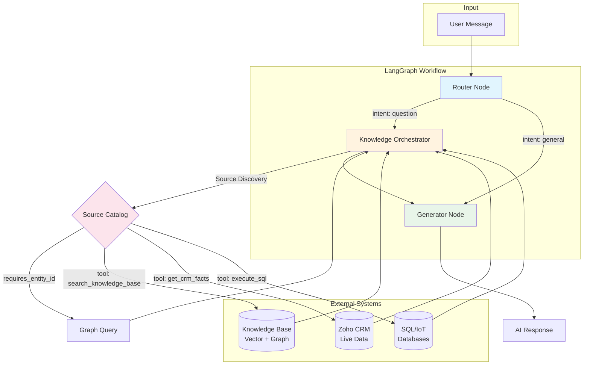
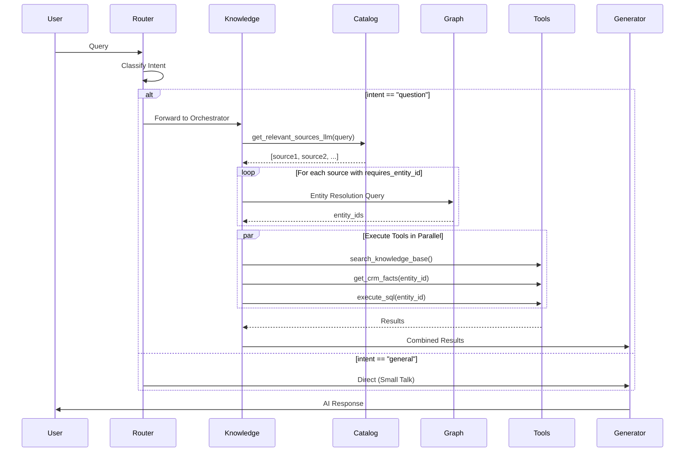
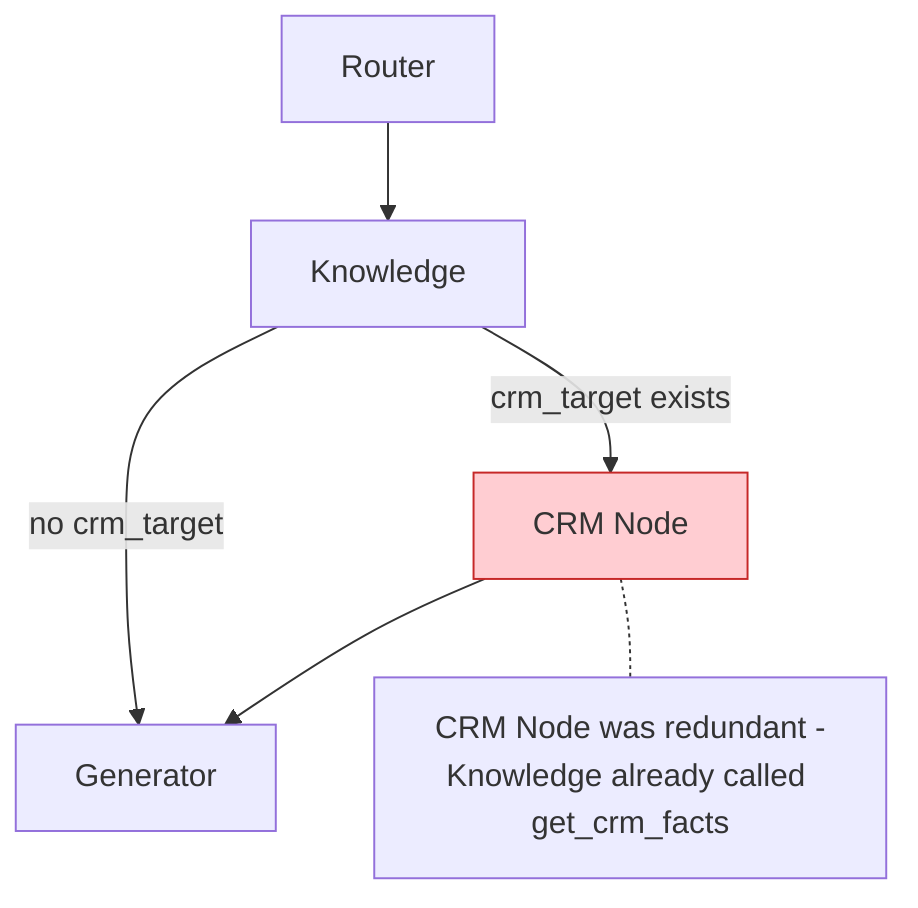

# Chat Workflow Architecture

## Current Architecture (Phase 3)

The workflow has been simplified to a 3-node architecture where the Knowledge Orchestrator serves as the central hub for all data retrieval.



## Node Descriptions

### 1. Router Node
**Purpose:** Pure intent classification

**Inputs:**
- User message

**Outputs:**
- `intent`: "question" or "general"

**Logic:**
```python
if "question" in intent_raw or "frage" in intent_raw:
    return "question"  # → Knowledge Orchestrator
else:
    return "general"   # → Generator (Small Talk)
```

### 2. Knowledge Orchestrator
**Purpose:** Central hub for all data retrieval

**Responsibilities:**
1. **LLM Source Discovery** - Asks LLM which sources are relevant for the query
2. **Entity Resolution** - Queries Graph if any source has `requires_entity_id: true`
3. **Tool Execution** - Calls appropriate tools based on Catalog configuration

**Inputs:**
- User message
- Intent

**Outputs:**
- `tool_outputs`: Dictionary with results from all sources
- `crm_target`: Entity ID if CRM source was used

### 3. Generator Node
**Purpose:** Synthesize final answer from multiple sources

**Inputs:**
- User message
- `tool_outputs` from Knowledge Orchestrator

**Outputs:**
- AI-generated response

## Source Catalog Flow

The Knowledge Orchestrator uses the Source Catalog (`external_sources.yaml`) to determine what to query:



## Previous Architecture (Deprecated)

The old 4-node architecture had a separate CRM Node:



**Why it was removed:**
- CRM Node called `get_crm_facts` - same as Knowledge Node
- Added ~1-2 seconds latency
- Complex conditional routing
- No added value

## State Structure

```python
class AgentState(TypedDict):
    messages: List[AnyMessage]      # Conversation history
    intent: str                     # "question" or "general"
    crm_target: str                 # Entity ID (e.g., "zoho_123456")
    tool_outputs: Dict[str, str]    # Results from all sources
```

## Performance Characteristics

| Metric | Value |
|--------|-------|
| Nodes | 3 |
| Average latency (question) | 3-8 seconds |
| Average latency (general) | 1-2 seconds |
| Parallel tool calls | Yes |

## Related Documentation

- [AGENTIC_RAG.md](./AGENTIC_RAG.md) - Overall RAG architecture
- [ARCHITECTURE.md](./ARCHITECTURE.md) - System architecture
- [ROUTING_LOGIC.md](./ROUTING_LOGIC.md) - Routing details
