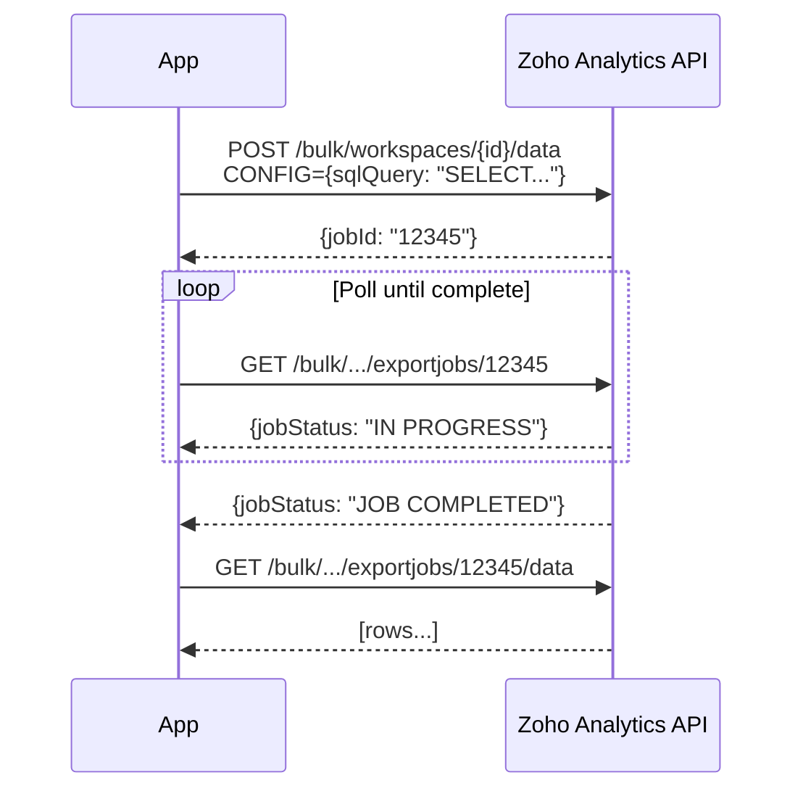

# Zoho Analytics API v2 Integration

**Date:** 2026-01-12
**Author:** Claude Code
**Type:** Feature / Bug Fix

## Summary

Fixed the Zoho Analytics API integration by switching to the correct Bulk Export API and adding the required `ZANALYTICS-ORGID` header.

## Problem

The original implementation used a non-existent `/sqlquery` endpoint, resulting in 400 Bad Request errors:

```
POST /restapi/v2/workspaces/{workspace_name}/data
→ 400 Bad Request
```

## Root Cause Analysis

1. **Wrong endpoint**: `/sqlquery` doesn't exist in Zoho Analytics API v2
2. **Missing header**: `ZANALYTICS-ORGID` is required for all API v2 calls
3. **Wrong identifier**: Used workspace_name instead of numeric workspace_id

## Solution

### 1. Changed to Bulk Export API (Async)

The Zoho Analytics API uses an async job-based approach:

```
Step 1: POST /bulk/workspaces/{workspace_id}/data → job_id
Step 2: GET  /bulk/workspaces/{workspace_id}/exportjobs/{job_id} → status
Step 3: GET  /bulk/workspaces/{workspace_id}/exportjobs/{job_id}/data → results
```

### 2. Added Required Header

```python
def _get_headers(self, token: str) -> Dict[str, str]:
    return {
        "Authorization": f"Zoho-oauthtoken {token}",
        "ZANALYTICS-ORGID": self.org_id,  # Required!
    }
```

### 3. New Configuration Variables

```python
# config.py
zoho_analytics_workspace_id: str | None  # Numeric ID
zoho_analytics_org_id: str | None        # Organization ID
zoho_analytics_api_base_url: str         # Region-specific URL
```

## Files Changed

| File | Changes |
|------|---------|
| `backend/app/integrations/zoho/analytics_client.py` | Complete rewrite for Bulk Export API |
| `backend/app/core/config.py` | Added `ZOHO_ANALYTICS_*` settings |
| `backend/app/integrations/zoho/provider.py` | Pass new parameters to Analytics client |
| `backend/app/services/crm_factory.py` | Initialize Analytics with new config |

## New Environment Variables

```bash
# Required for Analytics
ZOHO_ANALYTICS_WORKSPACE_ID=170896000000004002
ZOHO_ANALYTICS_ORG_ID=20084738965

# Optional (defaults to EU)
ZOHO_ANALYTICS_API_BASE_URL=https://analyticsapi.zoho.eu
```

## API Flow



## Usage Example

```python
async with ZohoAnalyticsClient(
    client_id=settings.zoho_client_id,
    client_secret=settings.zoho_client_secret,
    refresh_token=settings.zoho_refresh_token,
    workspace_id="170896000000004002",
    org_id="20084738965",
) as client:
    rows = await client.execute_sql(
        "SELECT * FROM Invoices WHERE Account_Name = 'Lumix-Solutions'"
    )
```

## OAuth Scopes Required

```
ZohoAnalytics.fullaccess.all
ZohoAnalytics.data.read
ZohoAnalytics.metadata.read
```

## Testing

Created debug scripts (now in `/legacy/`):
- `test_zoho_analytics_debug.py` - Step-by-step API exploration
- `test_analytics_api.py` - Integration test

## Related Changes

- [2026-01-12_phase3-workflow-simplification.md](./2026-01-12_phase3-workflow-simplification.md) - Workflow simplification (same session)
